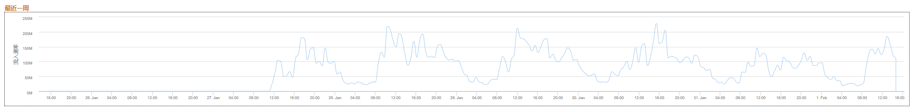
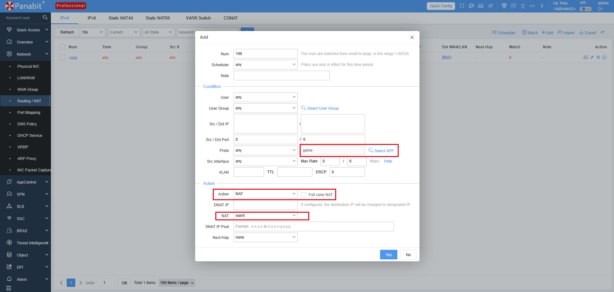
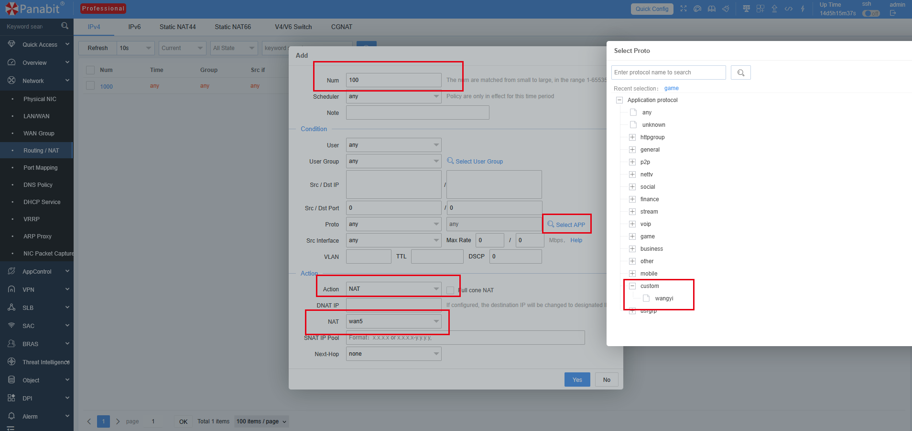

<h1 align="center">
  
  

  Panabit Intelligent Application Gateway
</h1>

  <a href="README_CN.md" style="color: #007bff; text-decoration: none; font-weight: bold;">中文</a> | English

---

# 📌 Table of Contents
1. [🌐 Background](#background)
2. [🔥 Challenges of Traditional Traffic Shaping](#challenges)
3. [🚀 Next-Gen Traffic Shaping: Flexible, Intelligent & Efficient](#next-gen-shaping)
4. [📌 Case Studies](#case-studies)
5. [⚙️ Basic Configuration](#configuration)
6. [📞 Contact Us](#contact)

---

# 🌐 **Background**  

In traditional network architectures, traffic shaping typically relies on **static rules** (IP addresses, port numbers, protocol types). While effective in stable environments, these methods face limitations in dynamic networks due to **inflexibility** and **inability to adapt to evolving requirements**.

---

## 🔥 **Challenges of Traditional Traffic Shaping**  

### 🔹 **Inflexibility in Dynamic Environments**  
- Reliance on fixed rules (IP/Port/Protocol) cannot handle **IP changes, business expansion, or traffic spikes**  
- Manual rule updates result in **high operational costs** and delayed adjustments

### 🔹 **Limited Traffic Intelligence**  
- Fails to identify **encrypted traffic, dynamic ports, or application-layer protocols**  
- Lacks real-time optimization based on network status (**bandwidth, latency, load**), compromising **QoS assurance**

---

## 🚀 **Next-Gen Traffic Shaping: Flexible, Intelligent & Efficient**  

Our application-aware traffic management automatically diverts non-critical applications (e.g., entertainment) to standard lines while maintaining QoS for business-critical traffic.
### 🎯 **Multi-Dimensional Traffic Matching**  
Supports hybrid criteria:
- **Five-tuple** (Source/Dest IP/Port, Protocol)
- **Application Protocols** (HTTP/HTTPS/DNS)
- **Domain Patterns** (e.g., `*.tiktok.com`)
- **VLAN/User Types/Network Interfaces**
  
### 🎯 **Precision Application Recognition**  

- Panabit possesses robust traffic identification capabilities. Its DPI system supports **five-tuple analysis** (source IP, destination IP, source port, destination port, protocol type), and can query the **ISP attribution** and **geographical location** of destination IPs. Additionally, it displays access timestamps and domain resolution capabilities.  

  

- Panabit integrates multiple technologies including **DPI**, **DFI**, node tracking, active probing, and encrypted traffic analysis to precisely identify encrypted P2P applications such as BT, Xunlei, Skype, eDonkey, PPFilm, and Baidu Player.  

  

- The DPI system also recognizes specific encapsulation types like **PPPoE** and **L2TP**, and supports protocol identification for **MPLS**, **RSVP**, **IGRP**, **BGP**, **ICMP**, and **OSPF**.  

  

### 🎯 **Hybrid Access Modes**  
Supports **2000+ access lines** including:  
- **DHCP/Static IP**  
- **PPPoE Dial-up**  
- **L2TP**

### 🎯 **High-Performance Forwarding**  
Capable of:  
- **100Gbps throughput**  
- **18M concurrent connections**  
- **Full-scenario access** for seamless traffic management
---

## 📌 **Case Studies**  

### **Enterprise Network Optimization**  
#### **Challenge**  
A government service provider faced **500M bandwidth congestion** during peak hours with unstable connectivity.

#### **Solution**  
Deployed Panabit gateway between core/edge switches, implementing:  
- **40% traffic diversion** to mobile networks  
- Application-based QoS prioritization

#### **Results**  
📈 **Performance Improvements**:  
- 200M downstream & 100M upstream traffic shifted  
- 40% bandwidth pressure reduction  
- Zero perceptible user impact
- 
📊 **Total Traffic Trends**:  

📊 **Downstream Traffic Trends of Diversion Link**:  

📊 **Upstream Traffic Trends of Diversion Link**: 

---

## ⚙️ **Basic Configuration**  

### 🔹 **Traffic Shaping Policy**  
**Path**: `Network  > Routing/NAT`  
**Steps**:
1. Create policy with unique ID  
2. Select target protocols (e.g., online games)  
3. Designate NAT line  
4. Deploy configuration  

### 🔹 **Custom Protocol (Example: NetEase Protocol)**  

📌 **Navigation Path**:  
- `[Application Recognition] -> [Custom Protocol Name] -> [Domain Association]`  
- Add **Domain & Port** and assign protocol category  

📌 **Step 1**:  
  
  

📌 **Step 2**:  
- Navigate to `[Network Settings] -> [Routing/NAT]`  
- Select **Custom Protocol** and assign **Priority NAT Line**  
- Click **Confirm** to deploy  

📌 **Configuration Example**:  

  

---

# 📞 **Contact Us**  

🔗 Official Website: [www.panabit.com](https://www.panabit.com/)  
🔗 Technical Forum: [bbs.panabit.com](https://bbs.panabit.com/)  

📧 Technical Support: support@panabit.com  

📞 Contact us for enterprise solutions!
