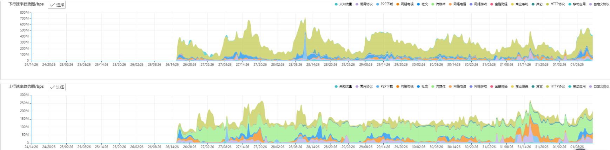
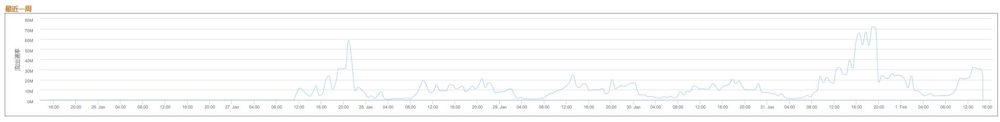
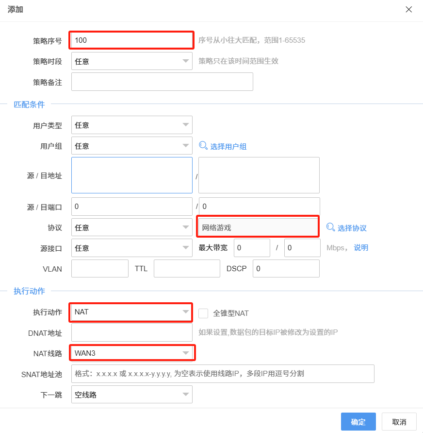
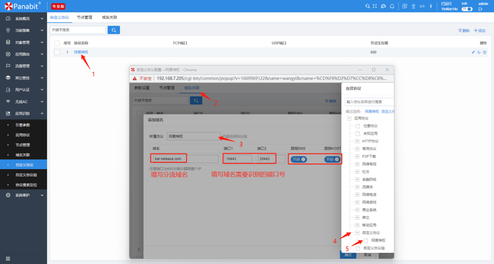
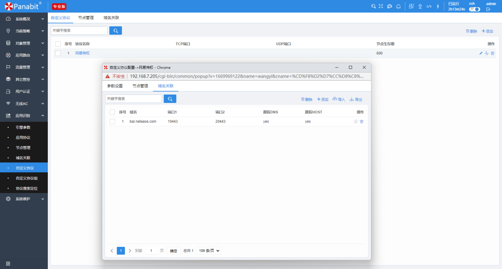
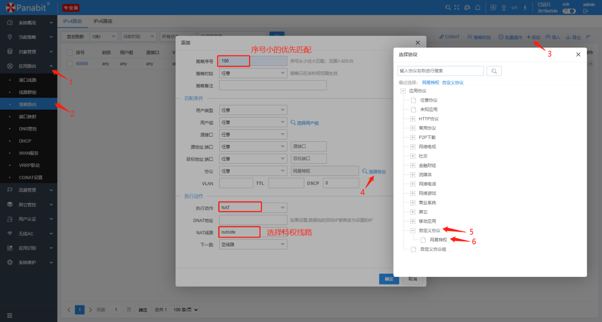

<h1 align="center">
  
   
  Panabit 智能应用网关
</h1>
<h4 align="center">出口一体化智能应用网关</h4>

  <a href="README_EN.md" style="color: #007bff; text-decoration: none; font-weight: bold;">English</a> | 中文

---

# 📌 目录
1. [🌐 背景](#背景)
2. [🔥 传统流量分流面临的挑战](#传统流量分流面临的挑战)
3. [🚀 新型流量分流：灵活、智能、高效](#新型流量分流灵活智能高效)
4. [📌 典型案例](#典型案例)
   - [网络业务分流案例](#网络业务分流案例)
5. [⚙️ 基本配置](#基本配置)
   - [NAT 分流策略](#nat-分流策略)
   - [自定义协议](#自定义协议)
6. [📞 联系我们](#联系我们)

---

# 🌐 **背景**
在传统网络架构中，流量分流通常依赖静态规则（Static Rules），例如基于 **IP 地址**、**端口号**、**协议类型** 等预定义策略进行流量调度。虽然这种方式在固定环境下能够有效工作，但随着业务需求的不断变化和网络环境的日益复杂，**静态规则的灵活性和适应性不足**，导致诸多问题。

---

## 🔥 **传统流量分流面临的挑战**

### 🔹 **缺乏灵活性，难以适应动态业务需求**  
- 依赖固定规则（IP、端口、协议），无法应对 **IP 变更、业务扩展、突发流量** 等情况。  
- 规则更新需手动维护，**运维成本高**，难以做到实时调整。  

### 🔹 **难以精准识别流量，缺乏智能调度能力**  
- 无法识别 **加密流量、动态端口或应用层协议**，导致分流策略失效。  
- 无法基于实时网络状态（**带宽、时延、负载**）进行动态调整，影响**流量优化**和**QoS 保障**。

---

## 🚀 **新型流量分流：灵活、智能、高效**

新型流量分流方式基于 **应用类型**进行智能调度，将 **不重要的娱乐应用** 无感知地分流到普通线路上，同时提供更大的可操作空间，以解决传统方式的局限性。

### 🎯 **多样化的分流方式**
支持多种匹配方式：  
- **五元组**（源 IP、目标 IP、源端口、目标端口、协议）  
- **应用协议**（如 HTTP、HTTPS、DNS）  
- **域名匹配**（如 `*.tiktok.com`、`*.netflix.com`）  
- **VLAN**、**网络接口**、**用户类型**等  

### 🎯 **精准的应用识别**
- 识别率高达 **95%+**，能够识别并控制 **14 大类、上千种应用**，确保流量精准分流。

### 🎯 **多样的链路接入方式**
支持超过 **2000+ 条线路接入**，包括：
- **DHCP**
- **静态 IP**
- **PPPOE 拨号**
- **L2TP**

### 🎯 **高性能的转发能力**
支持最高：
- **100G 吞吐**
- **1800 万并发连接**
- **全场景接入**，保障流量分流高效顺畅。

---

## 📌 **典型案例**  

### **📌 网络业务分流案例**  

#### **项目背景**  
某企业主要业务为**政企专线接入**，随着业务增长，**专线资源紧张**，高峰时段**网络不稳定**。  
面对这一问题，原方案为**扩容专线**，但整体**成本过高**，需寻找更优方案。  

#### **解决方案**  
采用 **Panabit 网关** 透明接入至 **内网核心交换机 & 出口交换机** 之间，**监测 2 天流量**后，将用户**感知体验较小的娱乐应用**调度至 **移动链路**，以降低原有**专线负载**，提升用户体验。

#### **分流成果**  
📈 **分流效果显著**：
- **40%** 总流量被成功分流  
- **用户体验无明显变化**  

📌 **带宽利用率提升**：
- 原电信专线总带宽 **500M**
- 设备接入后高峰期 **600M+**
- **提升专线使用率 & 改善用户体验**  

📌 **流量趋势变化**：
- **下行流量高峰期分流 200M**
- **上行流量高峰期分流 100M**
- **节省 40% 以上的带宽压力**  

📊 **总流量上下行趋势**：  
  

📊 **分流链路下行流量趋势**：  
  

📊 **分流链路上行流量趋势**：  
  

---

## ⚙️ **基本配置**  

### **🔹 分流策略**  
📌 **路径**： `【网络设置】->【路由/NAT】`  
📌 **步骤**：
1. 添加策略，填写序号  
2. 选择分流协议（如**网络游戏**）  
3. 选择 NAT 线路  
4. 点击 **确认**，完成部署  

📌 **示例截图**：  
  

---

### **🔹 自定义协议（以网易协议为例）**  
📌 **路径**：  
- `【应用识别】 -> 【自定义协议名称】 -> 【域名关联】`  
- 添加 **域名 & 端口**，选择所属协议  

📌 **步骤一**：  
  
  

📌 **步骤二**：  
- 进入 `【网络设置】 -> 【路由/NAT】`  
- 选择 **自定义协议**，并选择 NAT **特权线路**  
- **点击确认**，完成部署  

📌 **示例截图**：  
  

---

# 📞 **联系我们**  
🔗 访问官网：[www.panabit.com](https://www.panabit.com/)  
🔗 访问论坛：[bbs.panabit.com](https://bbs.panabit.com/)  
📞 联系我们，获取更详细的解决方案！
