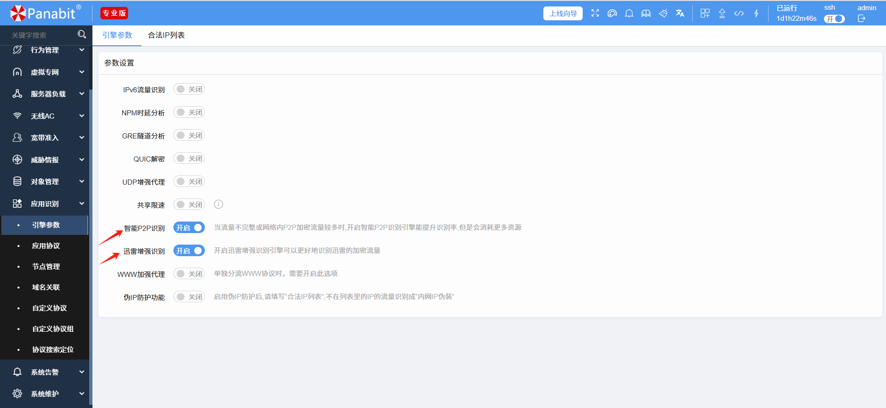
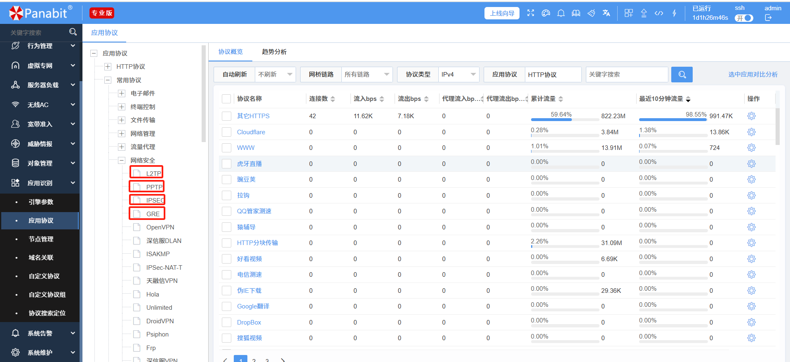
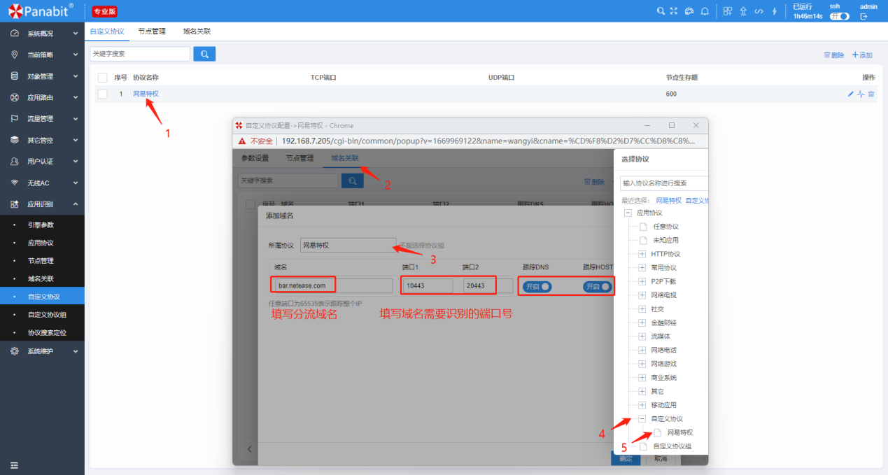
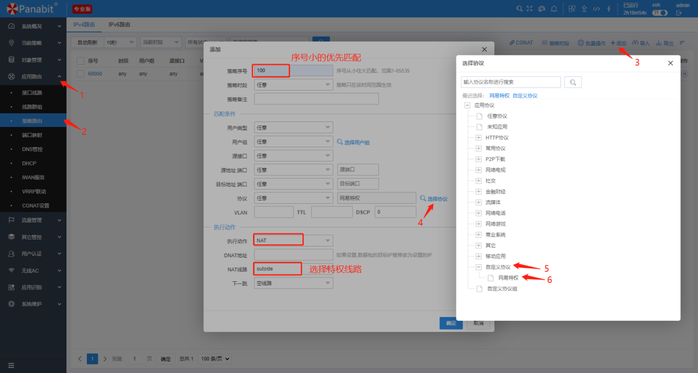

<h1 align="center">

  

   

  Panabit 智能应用网关

</h1>

<h4 align="center">出口一体化智能应用网关</h4>

  <a href="README.md" style="color: #007bff; text-decoration: none; font-weight: bold;">English</a> | 中文

---

# 应用分流解决方案

---

## 📌 目录

1. [🌐 背景](#背景)

2. [🔥 传统流量分流面临的挑战](#传统流量分流面临的挑战)

3. [🚀 新型流量分流：灵活、智能、高效](#新型流量分流灵活智能高效)

4. [📌 典型案例](#典型案例)

5. [⚙️ 基本配置](#基本配置)

6. [📞 联系我们](#联系我们)

---

# 🌐 **背景**  

在传统网络架构中，流量分流通常依赖静态规则（Static Rules），例如基于 **IP 地址**、**端口号**、**协议类型** 等预定义策略进行流量调度。虽然这种方式在固定环境下能够有效工作，但随着业务需求的不断变化和网络环境的日益复杂，**静态规则的灵活性和适应性不足**，导致诸多问题。

---

## 🔥 **传统流量分流面临的挑战**  

### 🔹 **缺乏灵活性，难以适应动态业务需求**  

- 依赖固定规则（IP、端口、协议），无法应对 **IP 变更、业务扩展、突发流量** 等情况。  

- 规则更新需手动维护，**运维成本高**，难以做到实时调整。

### 🔹 **难以精准识别流量，缺乏智能调度能力**  

- 无法识别 **加密流量、动态端口或应用层协议**，导致分流策略失效。  

- 无法基于实时网络状态（**带宽、时延、负载**）进行动态调整，影响**流量优化**和**QoS 保障**。

---

## 🚀 **新型流量分流：灵活、智能、高效**  

新型流量分流方式基于 **应用类型**进行智能调度，将 **不重要的娱乐应用** 无感知地分流到普通线路上，同时提供更大的可操作空间，以解决传统方式的局限性。

### 🎯 **多样化的分流方式**  

支持多种匹配方式：  

- **五元组**（源 IP、目标 IP、源端口、目标端口、协议）  

- **应用协议**（如 HTTP、HTTPS、DNS）  

- **域名匹配**（如 `*.tiktok.com`、`*.netflix.com`）  

- **VLAN**、**网络接口**、**用户类型**等

### 🎯 **精准的应用识别**  

- Panabit 具有丰富的业务数据流量识别能力。Panabit 的 DPI 系统不仅具备 IP 五元组识别能力，包括源 IP 地址，目的 IP 地址，源端口号、目的端口号和协议类型，还具备目的 IP 的运营商归属和地理位置查询能力。同时，它还能显示访问时间、域名的查询能力。

- Panabit 支持 DPI、DFI、节点跟踪、主动探测、加密分析等多种技术，对已经采用加密

技术的 P2P 类应用比如 BT、迅雷、Skype、eDonkey、PPFilm、百度影音等精确识别。

- Panabit 的 DPI 系统还具备特定封装类型的数据流量识别能力，比如 PPPOE、L2TP 流量

的识别。不仅如此，还支持对 MPLS、RSVP、IGRP、BGP、ICMP、OSPF 等协议的识别。

### 🎯 **多样的链路接入方式**  

支持超过 **2000+ 条线路接入**，包括：

- **DHCP**

- **静态 IP**

- **PPPOE 拨号**

- **L2TP**

### 🎯 **高性能的转发能力**  

支持最高：

- **100G 吞吐**

- **1800 万并发连接**

- **全场景接入**，保障流量分流高效顺畅。

---

## 📌 **典型案例**  

### **📌 网络业务分流案例**  

#### **项目背景**  

某企业主要业务为**政企专线接入**，随着业务增长，**专线资源紧张**，高峰时段**网络不稳定**。  

面对这一问题，原方案为**扩容专线**，但整体**成本过高**，需寻找更优方案。

#### **解决方案**  

采用 **Panabit 网关** 透明接入至 **内网核心交换机 & 出口交换机** 之间，**监测 2 天流量**后，将用户**感知体验较小的娱乐应用**调度至 **移动链路**，以降低原有**专线负载**，提升用户体验。

#### **分流成果**  

📈 **分流效果显著**：

- **40%** 总流量被成功分流  

- **用户体验无明显变化**

📌 **带宽利用率提升**：

- 原电信专线总带宽 **500M**

- 设备接入后高峰期 **600M+**

- **提升专线使用率 & 改善用户体验**

📌 **流量趋势变化**：

- **下行流量高峰期分流 200M**

- **上行流量高峰期分流 100M**

- **节省 40% 以上的带宽压力**

📊 **总流量上下行趋势**：  

📊 **分流链路下行流量趋势**：  

📊 **分流链路上行流量趋势**：  

---

## ⚙️ **基本配置**  

### **🔹 分流策略**  

📌 **路径**： `【网络设置】->【路由/NAT】`  

📌 **步骤**：

1. 添加策略，填写序号  

2. 选择分流协议（如**网络游戏**）  

3. 选择 NAT 线路  

4. 点击 **确认**，完成部署

📌 **示例截图**：  

---

### **🔹 自定义协议（以网易协议为例）**  

📌 **路径**：  

- `【应用识别】 -> 【自定义协议名称】 -> 【域名关联】`  

- 添加 **域名 & 端口**，选择所属协议

📌 **步骤一**：  

  

📌 **步骤二**：  

- 进入 `【网络设置】 -> 【路由/NAT】`  

- 选择 **自定义协议**，并选择 NAT **特权线路**  

- **点击确认**，完成部署

📌 **示例截图**：  

---

# 📞 **联系我们**  

🔗 访问官网：[www.panabit.com](https://www.panabit.com/)  

🔗 访问论坛：[bbs.panabit.com](https://bbs.panabit.com/)  

📧 技术支持邮箱：support@panabit.com

📞 联系我们，获取更详细的解决方案！
