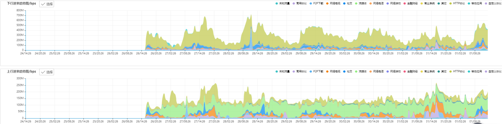
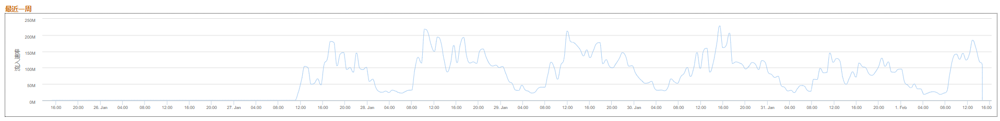
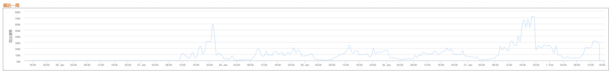
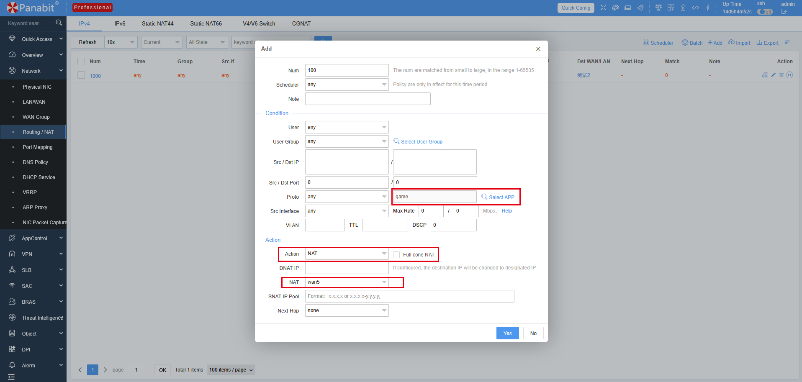
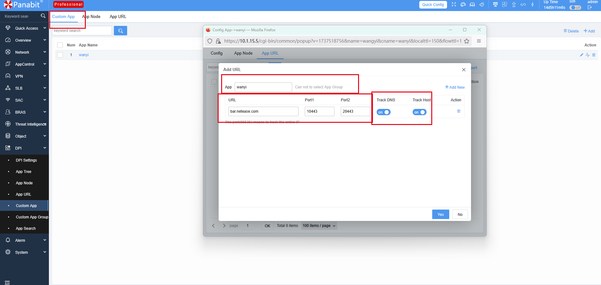
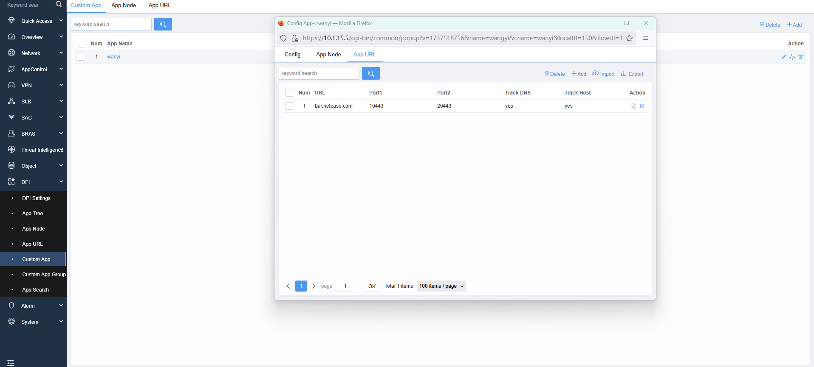
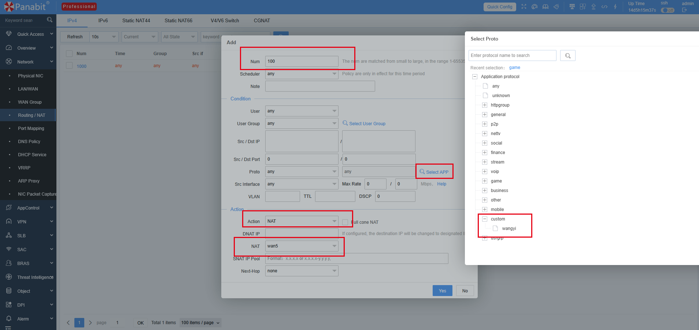

<h1 align="center">
  
   
  Panabit Intelligent Application Gateway
</h1>
<h4 align="center">Integrated Intelligent Application Gateway</h4>

  <a href="README.md" style="color: #007bff; text-decoration: none; font-weight: bold;">中文</a> | English

---

# 📌 Table of Contents
1. [🌐 Background](#background)
2. [🔥 Challenges of Traditional Traffic Splitting](#challenges-of-traditional-traffic-splitting)
3. [🚀 New Traffic Splitting: Flexible, Intelligent, Efficient](#new-traffic-splitting-flexible-intelligent-efficient)
4. [📌 Typical Case Studies](#typical-case-studies)
   - [Network Traffic Splitting Case](#network-traffic-splitting-case)
5. [⚙️ Basic Configuration](#basic-configuration)
   - [NAT Traffic Splitting Strategy](#nat-traffic-splitting-strategy)
   - [Custom Protocol](#custom-protocol)
6. [📞 Contact Us](#contact-us)

---

# 🌐 **Background**  

In traditional network architecture, traffic splitting typically relies on **static rules**, such as predefined policies based on **IP addresses, port numbers, and protocol types**. While effective in fixed environments, these static rules lack flexibility and adaptability, leading to various issues as business needs evolve and network environments become more complex.

---

## 🔥 **Challenges of Traditional Traffic Splitting**  

### 🔹 **Lack of Flexibility for Dynamic Business Needs**  
- Relies on fixed rules (IP, port, protocol) and cannot adapt to **IP changes, business expansion, or traffic surges**.  
- Manual rule updates lead to **high operational costs** and make real-time adjustments difficult.

### 🔹 **Limited Traffic Identification and Lack of Intelligent Scheduling**  
- Cannot recognize **encrypted traffic, dynamic ports, or application-layer protocols**, causing rule failures.  
- Lacks real-time traffic optimization based on **bandwidth, latency, and load**, impacting **QoS assurance**.

---

## 🚀 **New Traffic Splitting: Flexible, Intelligent, Efficient**  

New traffic splitting methods use **application-based intelligent scheduling**, redirecting **non-essential entertainment applications** to standard network links without user perception, offering a more flexible approach than traditional methods.

### 🎯 **Diverse Traffic Splitting Methods**  
Supports multiple matching approaches:  
- **Five-tuple** (Source IP, Destination IP, Source Port, Destination Port, Protocol)  
- **Application Protocols** (e.g., HTTP, HTTPS, DNS)  
- **Domain Matching** (e.g., `*.tiktok.com`, `*.netflix.com`)  
- **VLAN, Network Interfaces, User Types**, etc.

### 🎯 **Accurate Application Identification**  
- Achieves **95%+ recognition accuracy**, identifying and managing **14 major categories and thousands of applications** for precise traffic splitting.

### 🎯 **Diverse Link Access Methods**  
Supports over **2000+ link types**, including:
- **DHCP**
- **Static IP**
- **PPPoE Dial-Up**
- **L2TP**

### 🎯 **High-Performance Forwarding Capabilities**  
Supports up to:
- **100G throughput**
- **18 million concurrent connections**
- **Full-scale access**, ensuring efficient traffic splitting.

---

## 📌 **Typical Case Studies**  

### **📌 Network Traffic Splitting Case**  

#### **Project Background**  
A company specializing in **enterprise leased line access** faced **resource constraints** and **network instability during peak hours**. The initial solution was **leased line expansion**, but the costs were too high, requiring a more efficient alternative.

#### **Solution**  
The **Panabit Gateway** was deployed transparently between the **core switch & outbound switch**. After **monitoring traffic for 2 days**, entertainment applications with **minimal impact on user experience** were redirected to **mobile network links**, reducing leased line congestion and improving overall performance.

#### **Traffic Splitting Results**  
📈 **Significant Traffic Offloading**:
- **40%** of total traffic successfully offloaded  
- **No noticeable impact on user experience**

📌 **Increased Bandwidth Utilization**:
- Original telecom leased line: **500M**
- Post-implementation peak: **600M+**
- **Optimized bandwidth usage & enhanced user experience**

📌 **Traffic Trend Changes**:
- **200M offloaded during peak download periods**
- **100M offloaded during peak upload periods**
- **Over 40% reduction in bandwidth pressure**

📊 **Overall Traffic Trends**:  

📊 **Downstream Offloaded Traffic Trends**:  

📊 **Upstream Offloaded Traffic Trends**:  

---

## ⚙️ **Basic Configuration**  

### **🔹 Traffic Splitting Strategy**  
📌 **Path**: `【Network 】->【Routing/NAT】`   
📌 **Steps**:
1. Add a new policy and assign a priority
2. Select the traffic type (e.g., **Game**)
3. Choose the NAT link
4. Click **Confirm** to deploy

📌 **Example Screenshot**:  

---

### **🔹 Custom Protocol (Example: NetEase Protocol)**  

📌 **Path**:  
- `【DPI】 -> 【Custom App】 -> 【App URL】`
- Add **domain & port**, assign protocol category

📌 **Step 1**:  
  

📌 **Step 2**:  
- **Path**:  
-  `【Network 】 -> 【Routing/NAT】`
- Select **Custom Protocol**, assign NAT **priority link**
- **Click Confirm** to deploy

📌 **Example Screenshot**:  

---

# 📞 **Contact Us**  

🔗 Official Website: [www.panabit.com](https://www.panabit.com/)  
🔗 Forum: [bbs.panabit.com](https://bbs.panabit.com/)  
📧 Support Email: support@panabit.com  

📞 Contact us for more details and tailored solutions!

